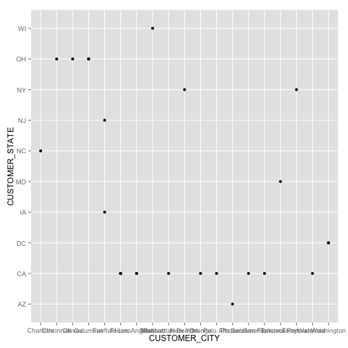
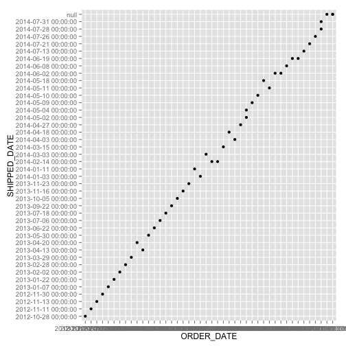
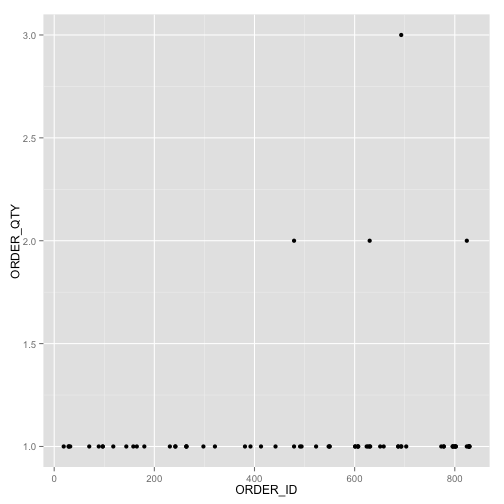
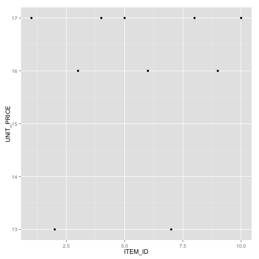
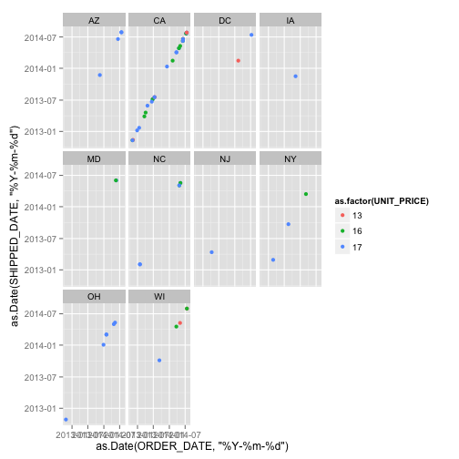
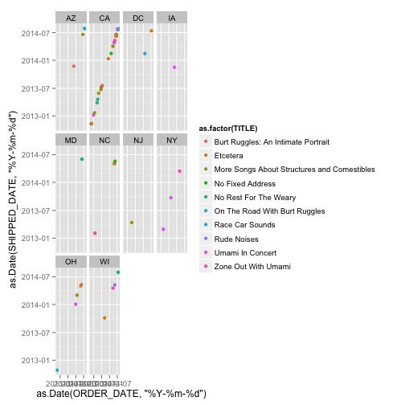
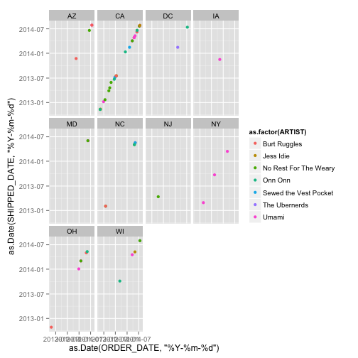

Group member: Anna Mengjie Yu (my3852),  Duy Vu (dhv242),  Syed Naqvi (san724)
DV_RProject1
========================================================

###This is an R Markdown document for DV_RProject1. 
In this project, we first created  4 data frames, and created an interesting plot based on each data frame.

1. In the customers table, we can see there are more customers from different cities in CA.

2. In the orders table, we can see the shipped date is linearly correlated with order date,
   i.e. the products are mostly shipped out at the relatively same speed after the order.
   
3. In the order_detail table, we can see certain product are more popular by some customer, as indicated by order id.

4. In the item table, we can see the range of unit price and the distribution of the price.


```r
source("../02 Visualizations/Rvisual.R", echo = TRUE)
```

```
## 
## > source("../01 Data/create_data_frame.R", echo = TRUE)
## 
## > library("bitops", lib.loc = "/Library/Frameworks/R.framework/Versions/3.1/Resources/library")
## 
## > library("ggplot2", lib.loc = "/Library/Frameworks/R.framework/Versions/3.1/Resources/library")
## 
## > library("gplots", lib.loc = "/Library/Frameworks/R.framework/Versions/3.1/Resources/library")
```

```
## 
## Attaching package: 'gplots'
## 
## The following object is masked from 'package:stats':
## 
##     lowess
```

```
## 
## > library("grid", lib.loc = "/Library/Frameworks/R.framework/Versions/3.1/Resources/library")
## 
## > library("plyr", lib.loc = "/Library/Frameworks/R.framework/Versions/3.1/Resources/library")
## 
## > library("RCurl", lib.loc = "/Library/Frameworks/R.framework/Versions/3.1/Resources/library")
## 
## > library("reshape2", lib.loc = "/Library/Frameworks/R.framework/Versions/3.1/Resources/library")
## 
## > df_customers <- data.frame(eval(parse(text = substring(getURL(URLencode("http://129.152.144.84:5001/rest/native/?query=\" select * from customers\"" .... [TRUNCATED] 
## 
## > df_customers
##    CUSTOMER_ID CUSTOMER_FIRST_NAME CUSTOMER_LAST_NAME
## 1            1               Korah             Blanca
## 2            2                Yash            Randall
## 3            3           Johnathon          Millerton
## 4            4             Mikayla             Damion
## 5            5             Kendall              Mayte
## 6            6             Kaitlin           Hostlery
## 7            7               Derek           Chaddick
## 8            8             Deborah             Damien
## 9            9              Karina               Lacy
## 10          10                Kurt           Nickalus
## 11          11              Kelsey            Eulalia
## 12          12              Anders           Rohansen
## 13          13              Thalia            Neftaly
## 14          14             Gonzalo             Keeton
## 15          15                Ania              Irvin
## 16          16              Dakota             Baylee
## 17          17              Samuel           Jacobsen
## 18          18              Justin              Javen
## 19          19                Kyle            Marissa
## 20          20               Erick            Kaleigh
## 21          21              Marvin            Quintin
## 22          22              Rashad          Holbrooke
## 23          23              Trisha               Anum
## 24          24              Julian             Carson
## 25          25             Kirsten              Story
##                  CUSTOMER_ADDRESS    CUSTOMER_CITY CUSTOMER_STATE
## 1                 1555 W Lane Ave         Columbus             OH
## 2           11 E Rancho Madera Rd          Madison             WI
## 3                  60 Madison Ave         New York             NY
## 4                2021 K Street Nw       Washington             DC
## 5           4775 E Miami River Rd           Cleves             OH
## 6           3250 Spring Grove Ave       Cincinnati             OH
## 7              9022 E Merchant Wy        Fairfield             IA
## 8                 415 E Olive Ave           Fresno             CA
## 9                 882 W Easton Wy      Los Angeles             CA
## 10        28210 N Avenue Stanford         Valencia             CA
## 11                7833 N Ridge Rd       Sacramento             CA
## 12            12345 E 67th Ave NW      Takoma Park             MD
## 13                2508 W Shaw Ave           Fresno             CA
## 14                 12 Daniel Road        Fairfield             NJ
## 15             1099 N Farcourt St           Orange             CA
## 16           1033 N Sycamore Ave.      Los Angeles             CA
## 17              3433 E Widget Ave        Palo Alto             CA
## 18                 828 S Broadway        Tarrytown             NY
## 19                789 E Mercy Ave          Phoenix             AZ
## 20 Five Lakepointe Plaza, Ste 500        Charlotte             NC
## 21      2677 Industrial Circle Dr         Columbus             OH
## 22           3467 W Shaw Ave #103           Fresno             CA
## 23               627 Aviation Way Manhatttan Beach             CA
## 24                372 San Quentin    San Francisco             CA
## 25          2401 Wisconsin Ave NW       Washington             DC
##    CUSTOMER_ZIP CUSTOMER_PHONE CUSTOMER_FAX
## 1         43221     6145554432   6145553920
## 2         53707     2095551205   2095552262
## 3         10010     2125554800         NULL
## 4         20006     2025555561         NULL
## 5         45002     5135553024         NULL
## 6         45225     8005552128   8005552640
## 7         52556     5155556352         NULL
## 8         93728     5595557888         NULL
## 9         90084     8005557248         NULL
## 10        91355     8055550464   8055556608
## 11        95887     2095557500   2095551302
## 12        24512     3385556736         NULL
## 13        93711     5595556352         NULL
## 14         7004     2015559742         NULL
## 15        92807     7145559040         NULL
## 16        90038     2135554322         NULL
## 17        92711     4155553536         NULL
## 18        10591     8005550080         NULL
## 19        85038     9475554304         NULL
## 20        28217     7045553664         NULL
## 21        43260     6145558528   6145557504
## 22        93711     5595558400   5595558400
## 23        90266     3105552640         NULL
## 24        94161     6175550464         NULL
## 25        20559     2065559115         NULL
## 
## > df_items <- data.frame(eval(parse(text = substring(getURL(URLencode("http://129.152.144.84:5001/rest/native/?query=\" select * from items\""), 
## +    .... [TRUNCATED] 
## 
## > df_items
##    ITEM_ID                                       TITLE
## 1        1                            Umami In Concert
## 2        2                             Race Car Sounds
## 3        3                       No Rest For The Weary
## 4        4 More Songs About Structures and Comestibles
## 5        5               On The Road With Burt Ruggles
## 6        6                            No Fixed Address
## 7        7                                 Rude Noises
## 8        8          Burt Ruggles: An Intimate Portrait
## 9        9                         Zone Out With Umami
## 10      10                                    Etcetera
##                   ARTIST UNIT_PRICE
## 1                  Umami         17
## 2          The Ubernerds         13
## 3  No Rest For The Weary         16
## 4  No Rest For The Weary         17
## 5           Burt Ruggles         17
## 6  Sewed the Vest Pocket         16
## 7              Jess Idie         13
## 8           Burt Ruggles         17
## 9                  Umami         16
## 10               Onn Onn         17
## 
## > df_order_details <- data.frame(eval(parse(text = substring(getURL(URLencode("http://129.152.144.84:5001/rest/native/?query=\" select * from order_de .... [TRUNCATED] 
## 
## > df_order_details
##    ORDER_ID ITEM_ID ORDER_QTY
## 1       381       1         1
## 2       601       9         1
## 3       442       1         1
## 4       523       9         1
## 5       630       5         1
## 6       778       1         1
## 7       693      10         1
## 8       118       1         1
## 9       264       7         1
## 10      607      10         1
## 11      624       7         1
## 12      658       1         1
## 13      800       5         1
## 14      158       3         1
## 15      321      10         1
## 16      687       6         1
## 17      827       6         1
## 18      144       3         1
## 19      264       8         1
## 20      479       1         2
## 21      630       6         2
## 22      796       5         1
## 23       97       4         1
## 24      601       5         1
## 25      773      10         1
## 26      800       1         1
## 27       29      10         1
## 28       70       1         1
## 29       97       8         1
## 30      165       4         1
## 31      180       4         1
## 32      231      10         1
## 33      392       8         1
## 34      413      10         1
## 35      491       6         1
## 36      494       2         1
## 37      606       8         1
## 38      607       3         1
## 39      651       3         1
## 40      703       4         1
## 41      796       2         1
## 42      802       2         1
## 43      802       3         1
## 44      824       7         2
## 45      829       1         1
## 46      550       4         1
## 47      796       7         1
## 48      829       2         1
## 49      693       6         1
## 50       29       3         1
## 51       32       7         1
## 52      242       1         1
## 53      298       1         1
## 54      479       4         1
## 55      548       9         1
## 56      627       9         1
## 57      778       3         1
## 58      687       8         1
## 59       19       5         1
## 60       89       4         1
## 61      242       6         1
## 62      264       4         1
## 63      550       1         1
## 64      631      10         1
## 65      693       7         3
## 66      824       3         1
## 67      829       5         1
## 68      829       9         1
## 
## > df_orders <- data.frame(eval(parse(text = substring(getURL(URLencode("http://129.152.144.84:5001/rest/native/?query=\" select * from orders\""), 
## +  .... [TRUNCATED] 
## 
## > df_orders
##    ORDER_ID CUSTOMER_ID          ORDER_DATE        SHIPPED_DATE
## 1        19           1 2012-10-23 00:00:00 2012-10-28 00:00:00
## 2        29           8 2012-11-05 00:00:00 2012-11-11 00:00:00
## 3        32          11 2012-11-10 00:00:00 2012-11-13 00:00:00
## 4        45           2 2012-11-25 00:00:00 2012-11-30 00:00:00
## 5        70          10 2012-12-28 00:00:00 2013-01-07 00:00:00
## 6        89          22 2013-01-20 00:00:00 2013-01-22 00:00:00
## 7        97          20 2013-01-29 00:00:00 2013-02-02 00:00:00
## 8       118           3 2013-02-24 00:00:00 2013-02-28 00:00:00
## 9       144          17 2013-03-21 00:00:00 2013-03-29 00:00:00
## 10      158           9 2013-04-04 00:00:00 2013-04-20 00:00:00
## 11      165          14 2013-04-11 00:00:00 2013-04-13 00:00:00
## 12      180          24 2013-04-25 00:00:00 2013-05-30 00:00:00
## 13      231          15 2013-06-14 00:00:00 2013-06-22 00:00:00
## 14      242          23 2013-06-24 00:00:00 2013-07-06 00:00:00
## 15      264           9 2013-07-15 00:00:00 2013-07-18 00:00:00
## 16      298          18 2013-08-18 00:00:00 2013-09-22 00:00:00
## 17      321           2 2013-09-09 00:00:00 2013-10-05 00:00:00
## 18      381           7 2013-11-08 00:00:00 2013-11-16 00:00:00
## 19      392          19 2013-11-16 00:00:00 2013-11-23 00:00:00
## 20      413          17 2013-12-05 00:00:00 2014-01-11 00:00:00
## 21      442           5 2013-12-28 00:00:00 2014-01-03 00:00:00
## 22      479           1 2014-01-30 00:00:00 2014-03-03 00:00:00
## 23      491          16 2014-02-08 00:00:00 2014-02-14 00:00:00
## 24      494           4 2014-02-10 00:00:00 2014-02-14 00:00:00
## 25      523           3 2014-03-07 00:00:00 2014-03-15 00:00:00
## 26      548           2 2014-03-22 00:00:00 2014-04-18 00:00:00
## 27      550          17 2014-03-23 00:00:00 2014-04-03 00:00:00
## 28      601          16 2014-04-21 00:00:00 2014-04-27 00:00:00
## 29      606           6 2014-04-25 00:00:00 2014-05-02 00:00:00
## 30      607          20 2014-04-25 00:00:00 2014-05-04 00:00:00
## 31      624           2 2014-05-04 00:00:00 2014-05-09 00:00:00
## 32      627          17 2014-05-05 00:00:00 2014-05-10 00:00:00
## 33      630          20 2014-05-08 00:00:00 2014-05-18 00:00:00
## 34      631          21 2014-05-09 00:00:00 2014-05-11 00:00:00
## 35      651          12 2014-05-19 00:00:00 2014-06-02 00:00:00
## 36      658          12 2014-05-23 00:00:00 2014-06-02 00:00:00
## 37      687          17 2014-06-05 00:00:00 2014-06-08 00:00:00
## 38      693           9 2014-06-07 00:00:00 2014-06-19 00:00:00
## 39      703          19 2014-06-12 00:00:00 2014-06-19 00:00:00
## 40      773          25 2014-07-11 00:00:00 2014-07-13 00:00:00
## 41      778          13 2014-07-12 00:00:00 2014-07-21 00:00:00
## 42      796          17 2014-07-19 00:00:00 2014-07-26 00:00:00
## 43      800          19 2014-07-21 00:00:00 2014-07-28 00:00:00
## 44      802           2 2014-07-21 00:00:00 2014-07-31 00:00:00
## 45      824           1 2014-08-01 00:00:00                null
## 46      827          18 2014-08-02 00:00:00                null
## 47      829           9 2014-08-02 00:00:00                null
## 
## > df_full <- data.frame(eval(parse(text = substring(getURL(URLencode("http://129.152.144.84:5001/rest/native/?query=\"select * from orders o join cust .... [TRUNCATED] 
## 
## > df_full
##    ORDER_ID CUSTOMER_ID          ORDER_DATE        SHIPPED_DATE
## 1       550          17 2014-03-23 00:00:00 2014-04-03 00:00:00
## 2       298          18 2013-08-18 00:00:00 2013-09-22 00:00:00
## 3       242          23 2013-06-24 00:00:00 2013-07-06 00:00:00
## 4       829           9 2014-08-02 00:00:00                null
## 5        70          10 2012-12-28 00:00:00 2013-01-07 00:00:00
## 6       800          19 2014-07-21 00:00:00 2014-07-28 00:00:00
## 7       479           1 2014-01-30 00:00:00 2014-03-03 00:00:00
## 8       658          12 2014-05-23 00:00:00 2014-06-02 00:00:00
## 9       118           3 2013-02-24 00:00:00 2013-02-28 00:00:00
## 10      778          13 2014-07-12 00:00:00 2014-07-21 00:00:00
## 11      442           5 2013-12-28 00:00:00 2014-01-03 00:00:00
## 12      381           7 2013-11-08 00:00:00 2013-11-16 00:00:00
## 13      829           9 2014-08-02 00:00:00                null
## 14      802           2 2014-07-21 00:00:00 2014-07-31 00:00:00
## 15      796          17 2014-07-19 00:00:00 2014-07-26 00:00:00
## 16      494           4 2014-02-10 00:00:00 2014-02-14 00:00:00
## 17      824           1 2014-08-01 00:00:00                null
## 18      778          13 2014-07-12 00:00:00 2014-07-21 00:00:00
## 19       29           8 2012-11-05 00:00:00 2012-11-11 00:00:00
## 20      802           2 2014-07-21 00:00:00 2014-07-31 00:00:00
## 21      651          12 2014-05-19 00:00:00 2014-06-02 00:00:00
## 22      607          20 2014-04-25 00:00:00 2014-05-04 00:00:00
## 23      144          17 2013-03-21 00:00:00 2013-03-29 00:00:00
## 24      158           9 2013-04-04 00:00:00 2013-04-20 00:00:00
## 25      264           9 2013-07-15 00:00:00 2013-07-18 00:00:00
## 26       89          22 2013-01-20 00:00:00 2013-01-22 00:00:00
## 27      479           1 2014-01-30 00:00:00 2014-03-03 00:00:00
## 28      550          17 2014-03-23 00:00:00 2014-04-03 00:00:00
## 29      703          19 2014-06-12 00:00:00 2014-06-19 00:00:00
## 30      180          24 2013-04-25 00:00:00 2013-05-30 00:00:00
## 31      165          14 2013-04-11 00:00:00 2013-04-13 00:00:00
## 32       97          20 2013-01-29 00:00:00 2013-02-02 00:00:00
## 33      829           9 2014-08-02 00:00:00                null
## 34       19           1 2012-10-23 00:00:00 2012-10-28 00:00:00
## 35      601          16 2014-04-21 00:00:00 2014-04-27 00:00:00
## 36      796          17 2014-07-19 00:00:00 2014-07-26 00:00:00
## 37      800          19 2014-07-21 00:00:00 2014-07-28 00:00:00
## 38      630          20 2014-05-08 00:00:00 2014-05-18 00:00:00
## 39      242          23 2013-06-24 00:00:00 2013-07-06 00:00:00
## 40      693           9 2014-06-07 00:00:00 2014-06-19 00:00:00
## 41      491          16 2014-02-08 00:00:00 2014-02-14 00:00:00
## 42      630          20 2014-05-08 00:00:00 2014-05-18 00:00:00
## 43      827          18 2014-08-02 00:00:00                null
## 44      687          17 2014-06-05 00:00:00 2014-06-08 00:00:00
## 45      693           9 2014-06-07 00:00:00 2014-06-19 00:00:00
## 46       32          11 2012-11-10 00:00:00 2012-11-13 00:00:00
## 47      796          17 2014-07-19 00:00:00 2014-07-26 00:00:00
## 48      824           1 2014-08-01 00:00:00                null
## 49      624           2 2014-05-04 00:00:00 2014-05-09 00:00:00
## 50      264           9 2013-07-15 00:00:00 2013-07-18 00:00:00
## 51      687          17 2014-06-05 00:00:00 2014-06-08 00:00:00
## 52      606           6 2014-04-25 00:00:00 2014-05-02 00:00:00
## 53      392          19 2013-11-16 00:00:00 2013-11-23 00:00:00
## 54       97          20 2013-01-29 00:00:00 2013-02-02 00:00:00
## 55      264           9 2013-07-15 00:00:00 2013-07-18 00:00:00
## 56      829           9 2014-08-02 00:00:00                null
## 57      627          17 2014-05-05 00:00:00 2014-05-10 00:00:00
## 58      548           2 2014-03-22 00:00:00 2014-04-18 00:00:00
## 59      523           3 2014-03-07 00:00:00 2014-03-15 00:00:00
## 60      601          16 2014-04-21 00:00:00 2014-04-27 00:00:00
## 61      631          21 2014-05-09 00:00:00 2014-05-11 00:00:00
## 62      413          17 2013-12-05 00:00:00 2014-01-11 00:00:00
## 63      231          15 2013-06-14 00:00:00 2013-06-22 00:00:00
## 64       29           8 2012-11-05 00:00:00 2012-11-11 00:00:00
## 65      773          25 2014-07-11 00:00:00 2014-07-13 00:00:00
## 66      321           2 2013-09-09 00:00:00 2013-10-05 00:00:00
## 67      607          20 2014-04-25 00:00:00 2014-05-04 00:00:00
## 68      693           9 2014-06-07 00:00:00 2014-06-19 00:00:00
##    CUSTOMER_ID.1 CUSTOMER_FIRST_NAME CUSTOMER_LAST_NAME
## 1             17              Samuel           Jacobsen
## 2             18              Justin              Javen
## 3             23              Trisha               Anum
## 4              9              Karina               Lacy
## 5             10                Kurt           Nickalus
## 6             19                Kyle            Marissa
## 7              1               Korah             Blanca
## 8             12              Anders           Rohansen
## 9              3           Johnathon          Millerton
## 10            13              Thalia            Neftaly
## 11             5             Kendall              Mayte
## 12             7               Derek           Chaddick
## 13             9              Karina               Lacy
## 14             2                Yash            Randall
## 15            17              Samuel           Jacobsen
## 16             4             Mikayla             Damion
## 17             1               Korah             Blanca
## 18            13              Thalia            Neftaly
## 19             8             Deborah             Damien
## 20             2                Yash            Randall
## 21            12              Anders           Rohansen
## 22            20               Erick            Kaleigh
## 23            17              Samuel           Jacobsen
## 24             9              Karina               Lacy
## 25             9              Karina               Lacy
## 26            22              Rashad          Holbrooke
## 27             1               Korah             Blanca
## 28            17              Samuel           Jacobsen
## 29            19                Kyle            Marissa
## 30            24              Julian             Carson
## 31            14             Gonzalo             Keeton
## 32            20               Erick            Kaleigh
## 33             9              Karina               Lacy
## 34             1               Korah             Blanca
## 35            16              Dakota             Baylee
## 36            17              Samuel           Jacobsen
## 37            19                Kyle            Marissa
## 38            20               Erick            Kaleigh
## 39            23              Trisha               Anum
## 40             9              Karina               Lacy
## 41            16              Dakota             Baylee
## 42            20               Erick            Kaleigh
## 43            18              Justin              Javen
## 44            17              Samuel           Jacobsen
## 45             9              Karina               Lacy
## 46            11              Kelsey            Eulalia
## 47            17              Samuel           Jacobsen
## 48             1               Korah             Blanca
## 49             2                Yash            Randall
## 50             9              Karina               Lacy
## 51            17              Samuel           Jacobsen
## 52             6             Kaitlin           Hostlery
## 53            19                Kyle            Marissa
## 54            20               Erick            Kaleigh
## 55             9              Karina               Lacy
## 56             9              Karina               Lacy
## 57            17              Samuel           Jacobsen
## 58             2                Yash            Randall
## 59             3           Johnathon          Millerton
## 60            16              Dakota             Baylee
## 61            21              Marvin            Quintin
## 62            17              Samuel           Jacobsen
## 63            15                Ania              Irvin
## 64             8             Deborah             Damien
## 65            25             Kirsten              Story
## 66             2                Yash            Randall
## 67            20               Erick            Kaleigh
## 68             9              Karina               Lacy
##                  CUSTOMER_ADDRESS    CUSTOMER_CITY CUSTOMER_STATE
## 1               3433 E Widget Ave        Palo Alto             CA
## 2                  828 S Broadway        Tarrytown             NY
## 3                627 Aviation Way Manhatttan Beach             CA
## 4                 882 W Easton Wy      Los Angeles             CA
## 5         28210 N Avenue Stanford         Valencia             CA
## 6                 789 E Mercy Ave          Phoenix             AZ
## 7                 1555 W Lane Ave         Columbus             OH
## 8             12345 E 67th Ave NW      Takoma Park             MD
## 9                  60 Madison Ave         New York             NY
## 10                2508 W Shaw Ave           Fresno             CA
## 11          4775 E Miami River Rd           Cleves             OH
## 12             9022 E Merchant Wy        Fairfield             IA
## 13                882 W Easton Wy      Los Angeles             CA
## 14          11 E Rancho Madera Rd          Madison             WI
## 15              3433 E Widget Ave        Palo Alto             CA
## 16               2021 K Street Nw       Washington             DC
## 17                1555 W Lane Ave         Columbus             OH
## 18                2508 W Shaw Ave           Fresno             CA
## 19                415 E Olive Ave           Fresno             CA
## 20          11 E Rancho Madera Rd          Madison             WI
## 21            12345 E 67th Ave NW      Takoma Park             MD
## 22 Five Lakepointe Plaza, Ste 500        Charlotte             NC
## 23              3433 E Widget Ave        Palo Alto             CA
## 24                882 W Easton Wy      Los Angeles             CA
## 25                882 W Easton Wy      Los Angeles             CA
## 26           3467 W Shaw Ave #103           Fresno             CA
## 27                1555 W Lane Ave         Columbus             OH
## 28              3433 E Widget Ave        Palo Alto             CA
## 29                789 E Mercy Ave          Phoenix             AZ
## 30                372 San Quentin    San Francisco             CA
## 31                 12 Daniel Road        Fairfield             NJ
## 32 Five Lakepointe Plaza, Ste 500        Charlotte             NC
## 33                882 W Easton Wy      Los Angeles             CA
## 34                1555 W Lane Ave         Columbus             OH
## 35           1033 N Sycamore Ave.      Los Angeles             CA
## 36              3433 E Widget Ave        Palo Alto             CA
## 37                789 E Mercy Ave          Phoenix             AZ
## 38 Five Lakepointe Plaza, Ste 500        Charlotte             NC
## 39               627 Aviation Way Manhatttan Beach             CA
## 40                882 W Easton Wy      Los Angeles             CA
## 41           1033 N Sycamore Ave.      Los Angeles             CA
## 42 Five Lakepointe Plaza, Ste 500        Charlotte             NC
## 43                 828 S Broadway        Tarrytown             NY
## 44              3433 E Widget Ave        Palo Alto             CA
## 45                882 W Easton Wy      Los Angeles             CA
## 46                7833 N Ridge Rd       Sacramento             CA
## 47              3433 E Widget Ave        Palo Alto             CA
## 48                1555 W Lane Ave         Columbus             OH
## 49          11 E Rancho Madera Rd          Madison             WI
## 50                882 W Easton Wy      Los Angeles             CA
## 51              3433 E Widget Ave        Palo Alto             CA
## 52          3250 Spring Grove Ave       Cincinnati             OH
## 53                789 E Mercy Ave          Phoenix             AZ
## 54 Five Lakepointe Plaza, Ste 500        Charlotte             NC
## 55                882 W Easton Wy      Los Angeles             CA
## 56                882 W Easton Wy      Los Angeles             CA
## 57              3433 E Widget Ave        Palo Alto             CA
## 58          11 E Rancho Madera Rd          Madison             WI
## 59                 60 Madison Ave         New York             NY
## 60           1033 N Sycamore Ave.      Los Angeles             CA
## 61      2677 Industrial Circle Dr         Columbus             OH
## 62              3433 E Widget Ave        Palo Alto             CA
## 63             1099 N Farcourt St           Orange             CA
## 64                415 E Olive Ave           Fresno             CA
## 65          2401 Wisconsin Ave NW       Washington             DC
## 66          11 E Rancho Madera Rd          Madison             WI
## 67 Five Lakepointe Plaza, Ste 500        Charlotte             NC
## 68                882 W Easton Wy      Los Angeles             CA
##    CUSTOMER_ZIP CUSTOMER_PHONE CUSTOMER_FAX ORDER_ID.1 ITEM_ID ORDER_QTY
## 1         92711     4155553536         NULL        550       1         1
## 2         10591     8005550080         NULL        298       1         1
## 3         90266     3105552640         NULL        242       1         1
## 4         90084     8005557248         NULL        829       1         1
## 5         91355     8055550464   8055556608         70       1         1
## 6         85038     9475554304         NULL        800       1         1
## 7         43221     6145554432   6145553920        479       1         2
## 8         24512     3385556736         NULL        658       1         1
## 9         10010     2125554800         NULL        118       1         1
## 10        93711     5595556352         NULL        778       1         1
## 11        45002     5135553024         NULL        442       1         1
## 12        52556     5155556352         NULL        381       1         1
## 13        90084     8005557248         NULL        829       2         1
## 14        53707     2095551205   2095552262        802       2         1
## 15        92711     4155553536         NULL        796       2         1
## 16        20006     2025555561         NULL        494       2         1
## 17        43221     6145554432   6145553920        824       3         1
## 18        93711     5595556352         NULL        778       3         1
## 19        93728     5595557888         NULL         29       3         1
## 20        53707     2095551205   2095552262        802       3         1
## 21        24512     3385556736         NULL        651       3         1
## 22        28217     7045553664         NULL        607       3         1
## 23        92711     4155553536         NULL        144       3         1
## 24        90084     8005557248         NULL        158       3         1
## 25        90084     8005557248         NULL        264       4         1
## 26        93711     5595558400   5595558400         89       4         1
## 27        43221     6145554432   6145553920        479       4         1
## 28        92711     4155553536         NULL        550       4         1
## 29        85038     9475554304         NULL        703       4         1
## 30        94161     6175550464         NULL        180       4         1
## 31         7004     2015559742         NULL        165       4         1
## 32        28217     7045553664         NULL         97       4         1
## 33        90084     8005557248         NULL        829       5         1
## 34        43221     6145554432   6145553920         19       5         1
## 35        90038     2135554322         NULL        601       5         1
## 36        92711     4155553536         NULL        796       5         1
## 37        85038     9475554304         NULL        800       5         1
## 38        28217     7045553664         NULL        630       5         1
## 39        90266     3105552640         NULL        242       6         1
## 40        90084     8005557248         NULL        693       6         1
## 41        90038     2135554322         NULL        491       6         1
## 42        28217     7045553664         NULL        630       6         2
## 43        10591     8005550080         NULL        827       6         1
## 44        92711     4155553536         NULL        687       6         1
## 45        90084     8005557248         NULL        693       7         3
## 46        95887     2095557500   2095551302         32       7         1
## 47        92711     4155553536         NULL        796       7         1
## 48        43221     6145554432   6145553920        824       7         2
## 49        53707     2095551205   2095552262        624       7         1
## 50        90084     8005557248         NULL        264       7         1
## 51        92711     4155553536         NULL        687       8         1
## 52        45225     8005552128   8005552640        606       8         1
## 53        85038     9475554304         NULL        392       8         1
## 54        28217     7045553664         NULL         97       8         1
## 55        90084     8005557248         NULL        264       8         1
## 56        90084     8005557248         NULL        829       9         1
## 57        92711     4155553536         NULL        627       9         1
## 58        53707     2095551205   2095552262        548       9         1
## 59        10010     2125554800         NULL        523       9         1
## 60        90038     2135554322         NULL        601       9         1
## 61        43260     6145558528   6145557504        631      10         1
## 62        92711     4155553536         NULL        413      10         1
## 63        92807     7145559040         NULL        231      10         1
## 64        93728     5595557888         NULL         29      10         1
## 65        20559     2065559115         NULL        773      10         1
## 66        53707     2095551205   2095552262        321      10         1
## 67        28217     7045553664         NULL        607      10         1
## 68        90084     8005557248         NULL        693      10         1
##    ITEM_ID.1                                       TITLE
## 1          1                            Umami In Concert
## 2          1                            Umami In Concert
## 3          1                            Umami In Concert
## 4          1                            Umami In Concert
## 5          1                            Umami In Concert
## 6          1                            Umami In Concert
## 7          1                            Umami In Concert
## 8          1                            Umami In Concert
## 9          1                            Umami In Concert
## 10         1                            Umami In Concert
## 11         1                            Umami In Concert
## 12         1                            Umami In Concert
## 13         2                             Race Car Sounds
## 14         2                             Race Car Sounds
## 15         2                             Race Car Sounds
## 16         2                             Race Car Sounds
## 17         3                       No Rest For The Weary
## 18         3                       No Rest For The Weary
## 19         3                       No Rest For The Weary
## 20         3                       No Rest For The Weary
## 21         3                       No Rest For The Weary
## 22         3                       No Rest For The Weary
## 23         3                       No Rest For The Weary
## 24         3                       No Rest For The Weary
## 25         4 More Songs About Structures and Comestibles
## 26         4 More Songs About Structures and Comestibles
## 27         4 More Songs About Structures and Comestibles
## 28         4 More Songs About Structures and Comestibles
## 29         4 More Songs About Structures and Comestibles
## 30         4 More Songs About Structures and Comestibles
## 31         4 More Songs About Structures and Comestibles
## 32         4 More Songs About Structures and Comestibles
## 33         5               On The Road With Burt Ruggles
## 34         5               On The Road With Burt Ruggles
## 35         5               On The Road With Burt Ruggles
## 36         5               On The Road With Burt Ruggles
## 37         5               On The Road With Burt Ruggles
## 38         5               On The Road With Burt Ruggles
## 39         6                            No Fixed Address
## 40         6                            No Fixed Address
## 41         6                            No Fixed Address
## 42         6                            No Fixed Address
## 43         6                            No Fixed Address
## 44         6                            No Fixed Address
## 45         7                                 Rude Noises
## 46         7                                 Rude Noises
## 47         7                                 Rude Noises
## 48         7                                 Rude Noises
## 49         7                                 Rude Noises
## 50         7                                 Rude Noises
## 51         8          Burt Ruggles: An Intimate Portrait
## 52         8          Burt Ruggles: An Intimate Portrait
## 53         8          Burt Ruggles: An Intimate Portrait
## 54         8          Burt Ruggles: An Intimate Portrait
## 55         8          Burt Ruggles: An Intimate Portrait
## 56         9                         Zone Out With Umami
## 57         9                         Zone Out With Umami
## 58         9                         Zone Out With Umami
## 59         9                         Zone Out With Umami
## 60         9                         Zone Out With Umami
## 61        10                                    Etcetera
## 62        10                                    Etcetera
## 63        10                                    Etcetera
## 64        10                                    Etcetera
## 65        10                                    Etcetera
## 66        10                                    Etcetera
## 67        10                                    Etcetera
## 68        10                                    Etcetera
##                   ARTIST UNIT_PRICE
## 1                  Umami         17
## 2                  Umami         17
## 3                  Umami         17
## 4                  Umami         17
## 5                  Umami         17
## 6                  Umami         17
## 7                  Umami         17
## 8                  Umami         17
## 9                  Umami         17
## 10                 Umami         17
## 11                 Umami         17
## 12                 Umami         17
## 13         The Ubernerds         13
## 14         The Ubernerds         13
## 15         The Ubernerds         13
## 16         The Ubernerds         13
## 17 No Rest For The Weary         16
## 18 No Rest For The Weary         16
## 19 No Rest For The Weary         16
## 20 No Rest For The Weary         16
## 21 No Rest For The Weary         16
## 22 No Rest For The Weary         16
## 23 No Rest For The Weary         16
## 24 No Rest For The Weary         16
## 25 No Rest For The Weary         17
## 26 No Rest For The Weary         17
## 27 No Rest For The Weary         17
## 28 No Rest For The Weary         17
## 29 No Rest For The Weary         17
## 30 No Rest For The Weary         17
## 31 No Rest For The Weary         17
## 32 No Rest For The Weary         17
## 33          Burt Ruggles         17
## 34          Burt Ruggles         17
## 35          Burt Ruggles         17
## 36          Burt Ruggles         17
## 37          Burt Ruggles         17
## 38          Burt Ruggles         17
## 39 Sewed the Vest Pocket         16
## 40 Sewed the Vest Pocket         16
## 41 Sewed the Vest Pocket         16
## 42 Sewed the Vest Pocket         16
## 43 Sewed the Vest Pocket         16
## 44 Sewed the Vest Pocket         16
## 45             Jess Idie         13
## 46             Jess Idie         13
## 47             Jess Idie         13
## 48             Jess Idie         13
## 49             Jess Idie         13
## 50             Jess Idie         13
## 51          Burt Ruggles         17
## 52          Burt Ruggles         17
## 53          Burt Ruggles         17
## 54          Burt Ruggles         17
## 55          Burt Ruggles         17
## 56                 Umami         16
## 57                 Umami         16
## 58                 Umami         16
## 59                 Umami         16
## 60                 Umami         16
## 61               Onn Onn         17
## 62               Onn Onn         17
## 63               Onn Onn         17
## 64               Onn Onn         17
## 65               Onn Onn         17
## 66               Onn Onn         17
## 67               Onn Onn         17
## 68               Onn Onn         17
## 
## > ggplot(df_customers, aes(x = CUSTOMER_CITY, y = CUSTOMER_STATE)) + 
## +     geom_point()
```

 

```
## 
## > ggplot(df_orders, aes(x = ORDER_DATE, y = SHIPPED_DATE)) + 
## +     geom_point()
```

 

```
## 
## > ggplot(df_order_details, aes(x = ORDER_ID, y = ORDER_QTY)) + 
## +     geom_point()
```

 

```
## 
## > ggplot(df_items, aes(x = ITEM_ID, y = UNIT_PRICE)) + 
## +     geom_point()
```

 

```
## 
## > p1 <- ggplot(df_full, aes(x = as.Date(ORDER_DATE, 
## +     "%Y-%m-%d"), y = as.Date(SHIPPED_DATE, "%Y-%m-%d"), color = as.factor(UNIT_PRICE))) + 
## +    .... [TRUNCATED] 
## 
## > p1 + facet_wrap(~CUSTOMER_STATE)
```

```
## Warning: Removed 4 rows containing missing values (geom_point).
```

```
## Warning: Removed 1 rows containing missing values (geom_point).
```

```
## Warning: Removed 2 rows containing missing values (geom_point).
```

 

```
## 
## > p2 <- ggplot(df_full, aes(x = as.Date(ORDER_DATE, 
## +     "%Y-%m-%d"), y = as.Date(SHIPPED_DATE, "%Y-%m-%d"), color = as.factor(TITLE))) + 
## +     geo .... [TRUNCATED] 
## 
## > p2 + facet_wrap(~CUSTOMER_STATE)
```

```
## Warning: Removed 4 rows containing missing values (geom_point).
```

```
## Warning: Removed 1 rows containing missing values (geom_point).
```

```
## Warning: Removed 2 rows containing missing values (geom_point).
```

 

```
## 
## > p3 <- ggplot(df_full, aes(x = as.Date(ORDER_DATE, 
## +     "%Y-%m-%d"), y = as.Date(SHIPPED_DATE, "%Y-%m-%d"), color = as.factor(ARTIST))) + 
## +     ge .... [TRUNCATED] 
## 
## > p3 + facet_wrap(~CUSTOMER_STATE)
```

```
## Warning: Removed 4 rows containing missing values (geom_point).
```

```
## Warning: Removed 1 rows containing missing values (geom_point).
```

```
## Warning: Removed 2 rows containing missing values (geom_point).
```

 


